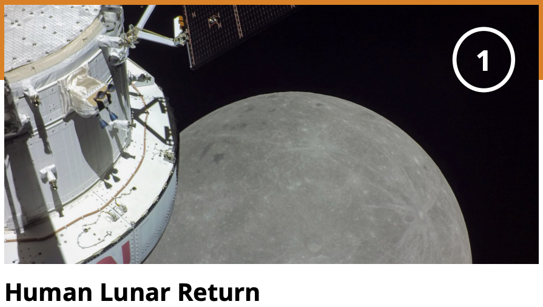

# Reanalysis of Lunar regolith data using a general Regolith model

**Abstract:** The Green Revolution of the mid-20th century introduced high-yielding dwarf crops, including rice, wheat, and maize, which dramatically increased global food production. Interestingly, these crops are resistant to a selection of abiotic environmental stressors, such as salt stress, mechanical stimuli, drought and some kinds of necrotrophic fungi. To overcome the novel challenges associated with successfully cultivating crops on the moon, where regolith conditions are harsh and nutrient-poor, we simply need to invert our knowledge gained from the Green Revolution that was used to produce dwarf crops. Future lunar agriculture requires the development of crops with stronger, deeper roots that can better access water and nutrients while also using them more efficiently. This can potentially be achieved through genetic modification of Green Revolution alleles, marker-assisted selection of natural variants, the synthesis of new mutants, or the simple addition of growth hormones like gibberellic acid to the water supply of crops grown in lunar regolith. Thus, by inverting our green revolution agricultural practices and building on the knowledge of our past genetic successes, we can work towards a new Greener Revolution to ensure sustainable food production both on Earth and beyond.

<figure><figcaption>
Deep learning about regolith using plants
</figcaption></figure>

**Key words:** Lunar regolith, Ionic stresses, In-situ resources, Nutrient uptake, _Arabidopsis thaliana_, Gene expression, Transcriptomes, Differentially expressed genes (DEGs), Ribosomes, Protein synthesis, DNA replication, Plant-pathogen interaction, Glucosinolate, Homologous recombination, Phenylpropanoid, Hormonal signalling, ABA, Ethylene, JA, MYC, DELLA, Green Revolution

**Active repo for data and code sharing.**



Introduction to the moon.


Watch this ["Tour of the Moon"](https://youtu.be/nr5Pj6GQL2o?si=i\_1\_P392M0lkRxqG) in 4K video.


***

Methods for reanalysis

This repo contains counts created for the "Lunar\_regolith" assay using the NF\_core RNAseq pipeline.

<figure><figcaption></figcaption></figure>



***

Preliminary analysis

[Here is a link to a rough draft of a written manuscript](https://docs.google.com/document/d/1-np5DNb4gzrFckPqts1aCl-zTZpZt98fSMhH4DehIKQ/edit?usp=sharing).

[Here is a link to a rough draft of a slide show narrative](https://docs.google.com/presentation/d/1a\_\_b4exPY8by33kcYLlLfEo\_rVxcj7CM7w\_\_xbTRThE/edit?usp=sharing).

***

