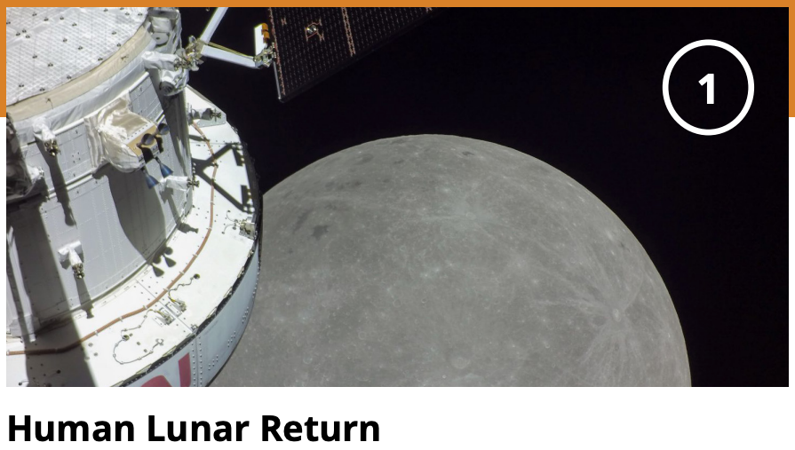

# Exploration Lesson Plan

**Introduction**

**Student question/ Goal: How to weave plants and agriculture into this narrative?**

**Stage 1:**

<figure><figcaption></figcaption></figure>

**Stage 2:**

<figure><figcaption></figcaption></figure>

**Stage 3:**

<figure><figcaption></figcaption></figure>

**Stage 4:**

<figure><figcaption></figcaption></figure>

**Conclusion:  the future has yet to be written...**

**What did you learn?**&#x20;

