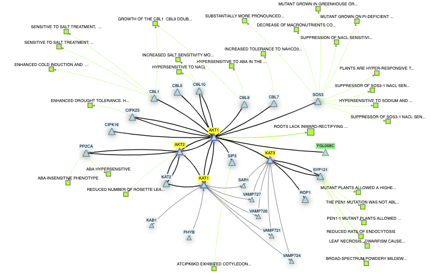
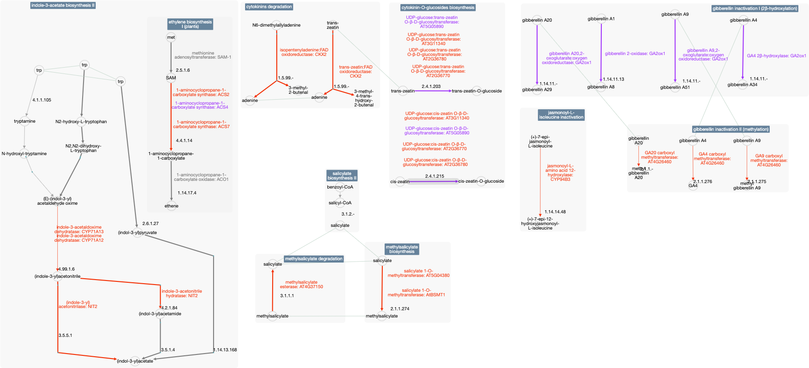
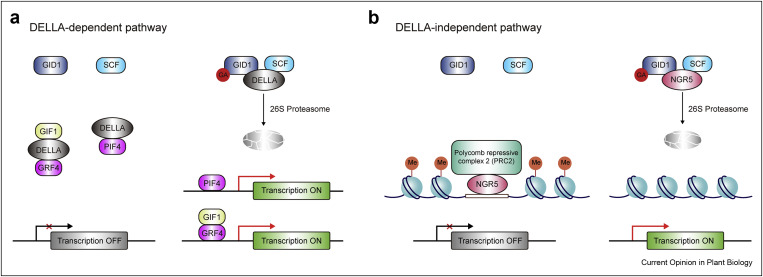
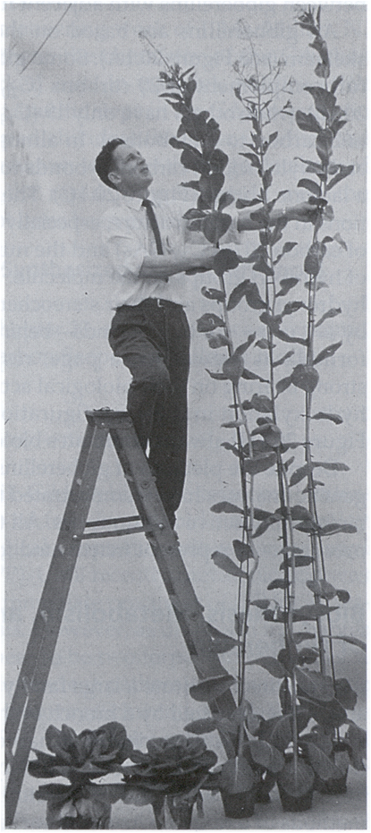
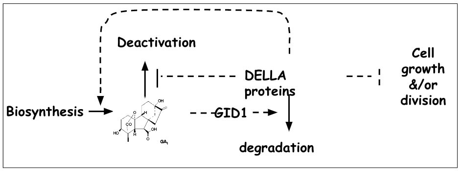
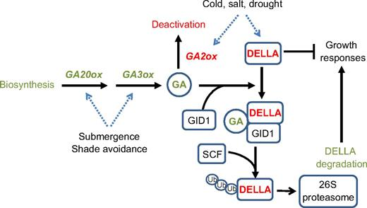
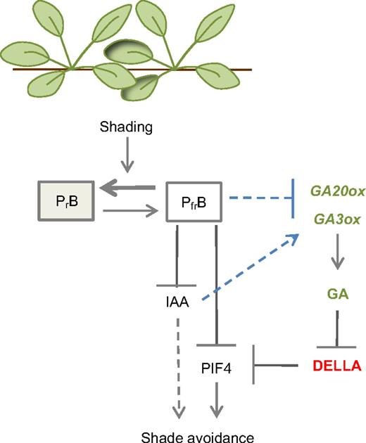

# BROAD lunar model provides evidence for DELLA potential stabilisation

_Summary of the hormonal response of Arabidospsi to Regolith vs simulant using BROAD lunar model._

A Closer look at hormonal signalling pathway in the BROAD lunar model using KEGG pathview (**Figure X**) for lunar samples vs simulants reveals evidence for changes in not just ABA signalling but also changes to SA, Ethylene, JA, IAA and GA metabolism. DELLA proteins play a crucial role in regulating multiple hormone signals that control various plant processes. For example, DELLA interacts with BZR1, ARF6, and PIF4 to modulate GA, BR, and light/temperature signalling, thereby affecting hypocotyl cell elongation. In addition, DELLA inhibits the function of EIN3, a protein that is essential for ET-mediated apical hook formation. This interaction affects the expression of HLS1 and RAP2.3, which are crucial for this process. Changes in DELLA stability could, therefore, impact apical hook formation in plants grown on the moon, affecting their ability to respond to gravity and other environmental cues. DELLA plays a role in plant defense mechanisms by positively regulating JA-mediated resistance to herbivory and necrotrophic pathogens. Changes in DELLA stability could impact the plant's ability to defend itself against pests and diseases on the moon, where the absence of a significant atmosphere could increase the risk of such problems. DELLA mediates GA- and CK-dependent regulation of photomorphogenesis, which is crucial for plant growth and development. Changes in DELLA stability could affect this process, impacting the overall health and productivity of lunar crops.

Changes in the expression of stress-responsive transcription factors that can be observed via changes in PIF, MYC2, NAC, ERF and WRY transcription factors along with the loci they regulate can be detected. These loci feedback on the regulation of both GA biosynthesis and catabolic enzymes. Colebrook _et al._, (2014) discuss the regulation of gibberellic acid (GA) metabolism and signalling during terrestrial abiotic stress in plants. Meta-Analysis of publicly available microarray data reveals abiotic stresses including cold, salt, osmotic, or dehydration stress cause plants reduce GA content through upregulation of GA methylation / deactivation genes, with addition to the downregulation of GA20ox and/or GA3ox biosynthetic genes, this duel regulation of both GA synthesis and degradation mechanisms can used to slow growth as a stress response system. The suppression of CPS is evidence of suppression of fundal slowing of metabolism. The suppression for GA20ox1 in the shoots indicates they are experiencing osmotic stress (Colbrook et al., 2014). There is a small but consistent increase in expression in each of the GA GID receptors potentially indicating that the plants have increased sensitivity to GA, which is part of a known positive feedback loop caused by GA deficiency (Griffis et al 2006). There is a pronounced increase in the expression of a GA methylation enzyme that is known to deactivate C19 GAs, demonstrating that the plant is perceiving stress and activating and suppressing growth in response. These data indicate a reduction in GA levels which is likely to lead to an increase in DELLA stability.

DELLA proteins are known to play an important role in regulating various cellular processes such as cell expansion, cellular defense metabolism, and cell division by interacting with other transcription factors. In plants, DELLA proteins act as negative regulators of growth and development by inhibiting the transcriptional activity of various transcription factors, such as PHYTOCHROME INTERACTING FACTORS (PIFs), basic helix-loop-helix (bHLH) transcription factors, and WRKY transcription factors. The interaction between DELLA proteins and PIFs is particularly important in regulating cell expansion. Under high levels of gibberellin (GA) hormones, DELLA proteins are degraded, which leads to the activation of PIFs and the subsequent activation of downstream genes that promote cell expansion. Conversely, under low levels of GA hormones, DELLA proteins are stabilized, which results in the inhibition of PIFs and the suppression of cell expansion.

DELLA proteins also play a crucial role in regulating cellular defense metabolism by interacting with other transcription factors such as JASMONATE-ZIM DOMAIN (JAZ) proteins. Under stress conditions, DELLA proteins bind to JAZ proteins, which leads to the activation of downstream genes involved in the biosynthesis of secondary metabolites that act as defense compounds against herbivores and pathogens. This can be seen in the TF enrichment data (see deep dive slide show) where DELLA proteins are forming growing suppression complexes, these gene expression regulatory changes are downstream symptoms of changes to DELLA stability (REF). RGL3 is significantly increased in expression at the transcriptional level, this has been shown previously in shoots in response to dehydration stress ((Colbrook et al., 2014). The changes in regolith are different to those described in Colebrooke et al., (2014) are similar but different from the lunar regolith response which is more closely responsible for a combination of flood and mechanical would similar to herbivory.

Finally, in regulating cell division, DELLA proteins interact with a class of transcription factors called GRAS (GIBBERELLIN ACID INSENSITIVE, REPRESSOR OF ga1-3, and SCARECROW) proteins. The interaction between DELLA proteins and GRAS proteins inhibits cell division by preventing the expression of genes involved in cell cycle progression. Overall, the interaction of DELLA proteins with various transcription factors plays a critical role in regulating cellular processes such as cell expansion, cellular defense metabolism, and cell division in plants. We propose that the regulation of expression or activity of transcription factors that modulate the expression of GA metabolism genes could represent one mechanism by which GA signalling is integrated into the wider stress response network that can produce shorter, fatter roots (REF can also link to ethylene with link to spaceflight and/or soil compaction). Furthermore, DELLA protein signalling integrates developmental and environmental signals across many stages of development, integrating signals from multiple hormonal pathways in response to a range of environmental stresses.

<figure><figcaption>
GAI
</figcaption></figure>

 

<figure><figcaption>
GAI
</figcaption></figure>

<figure><figcaption>
RGA
</figcaption></figure>

 

<figure><figcaption>
RGA
</figcaption></figure>

<figure><figcaption>
RGL2
</figcaption></figure>

 

<figure><figcaption>
RGL2
</figcaption></figure>

<figure><figcaption>
RGL3
</figcaption></figure>

 

<figure><figcaption>
RGL3
</figcaption></figure>

<figure><figcaption>
GA3ox1
</figcaption></figure>

 

<figure><figcaption>
GA3ox1
</figcaption></figure>

<figure><figcaption>
GA3ox2
</figcaption></figure>

 

<figure><figcaption>
GA3ox2
</figcaption></figure>

<figure><figcaption>
GA20ox1
</figcaption></figure>

 

<figure><figcaption>
GA20ox1
</figcaption></figure>

<figure><figcaption>
GA20ox2
</figcaption></figure>

 

<figure><figcaption>
GA20ox2
</figcaption></figure>

<figure><figcaption>
GA20ox3
</figcaption></figure>

 

<figure><figcaption>
GA20ox3
</figcaption></figure>

<figure><figcaption>
GA20ox5
</figcaption></figure>

 

<figure><figcaption>
GA20ox5
</figcaption></figure>

<figure><figcaption></figcaption></figure>

 

<figure><figcaption>
KAO
</figcaption></figure>

<figure><figcaption>
GA2ox1
</figcaption></figure>

 

<figure><figcaption>
GA2ox1
</figcaption></figure>

<figure><figcaption>
GASA
</figcaption></figure>

 

<figure><figcaption>
GASA
</figcaption></figure>

<figure><figcaption>
SKOR
</figcaption></figure>

 

<figure><figcaption>
SKOR
</figcaption></figure>

<figure><figcaption>
GORK
</figcaption></figure>

 

<figure><figcaption>
GORK
</figcaption></figure>

<figure><figcaption>
AKT1
</figcaption></figure>

 

<figure><figcaption>
AKT1
</figcaption></figure>

<figure><figcaption>
Akt1-1 differentially expressed genes p&#x3C;0.05 (results from microarray and metascape mining by DRB)
</figcaption></figure>

<figure><figcaption>
AKT6
</figcaption></figure>

 

<figure><figcaption>
AKT6
</figcaption></figure>

<figure><figcaption>
KAT1
</figcaption></figure>

 

<figure><figcaption>
KAT1
</figcaption></figure>

<figure><figcaption>
KAT3
</figcaption></figure>

 

<figure><figcaption>
KAT3
</figcaption></figure>

<figure><figcaption></figcaption></figure>

**Table XX:** Insert summary table of plant hormonal loci from the Broad Lunar model.

<table data-header-hidden><thead><tr><th width="148"></th><th></th><th></th><th></th><th></th></tr></thead><tbody><tr><td><strong>Symbol</strong></td><td><strong>Gene ID</strong></td><td><strong>Moon-Earth_log2FoldChange</strong></td><td><strong>Moon-Earth_padj</strong></td><td><strong>Function</strong></td></tr><tr><td><em><strong>CPS</strong></em></td><td>AT4G02780</td><td><strong>-2.101</strong></td><td><strong>0.023</strong></td><td><strong>GA precursor synthesis</strong></td></tr><tr><td><em>KAO</em></td><td><strong>AT2G18620</strong> </td><td>-0.487</td><td>0.198</td><td><strong>GA precursor synthesis</strong></td></tr><tr><td><em><strong>KO</strong></em></td><td><strong>AT5G25900</strong></td><td><strong>0.482</strong></td><td><strong>0.017</strong></td><td><strong>GA precursor synthesis</strong></td></tr><tr><td><em>KS</em></td><td>AT1G79460</td><td>-0.521</td><td><strong>0.115</strong></td><td><strong>GA12 biosynthesis</strong></td></tr><tr><td><em>GA20ox1</em></td><td>AT4G25420</td><td>0.004</td><td>0.995</td><td>Penultimate activation</td></tr><tr><td><em>GA20ox2</em></td><td>AT5G51810</td><td>1.156</td><td><strong>0.170</strong></td><td>Penultimate activation</td></tr><tr><td><em>GA3ox1</em></td><td>AT1G15550</td><td>-0.558</td><td>0.378</td><td>GA activation</td></tr><tr><td><em>GA3ox2</em></td><td>AT1G80340</td><td>-1.078</td><td>0.249</td><td>GA activation</td></tr><tr><td><em><strong>GA2ox1</strong></em></td><td><strong>AT1G02400</strong></td><td><strong>-2.168</strong></td><td><strong>0.044</strong></td><td><strong>GA deactivation</strong></td></tr><tr><td><em>GA2ox2</em></td><td>AT1G30040</td><td>0.139</td><td>0.742</td><td>GA deactivation</td></tr><tr><td><em>GA2ox4</em></td><td>AT1G47990</td><td>0.551</td><td>0.494</td><td>GA deactivation</td></tr><tr><td><em>GA2ox6</em></td><td>AT1G02400</td><td>0.528</td><td>0.236</td><td>GA deactivation</td></tr><tr><td><em>GID1a</em></td><td>AT3G05120</td><td>0.428</td><td><strong>0.162</strong></td><td><strong>GA perception</strong></td></tr><tr><td><em>GID1b</em></td><td>AT3G63010</td><td>0.810</td><td><strong>0.167</strong></td><td><strong>GA perception</strong></td></tr><tr><td><em>GID1c</em></td><td>AT5G27320</td><td>0.210</td><td><strong>0.148</strong></td><td><strong>GA perception</strong></td></tr><tr><td><em>GA Methyltransferase</em></td><td>AT4G26460</td><td><strong>2.037</strong></td><td>0.380</td><td><strong>GA deactivation</strong></td></tr><tr><td><em>GAI</em></td><td>AT1G14920</td><td>-0.114</td><td>0.423</td><td>GA signaling</td></tr><tr><td><em>RGA</em></td><td>AT2G01570</td><td>-0.096</td><td>0.683</td><td>GA signaling</td></tr><tr><td><em>RGL1</em></td><td>AT1G66350</td><td>-0.892</td><td>0.083</td><td>GA signaling</td></tr><tr><td><em>RGL2</em></td><td>AT3G03450</td><td>0.424</td><td>0.398</td><td>GA signaling</td></tr><tr><td><em>RGL3</em></td><td>AT5G17490</td><td>0.760</td><td><strong>0.181</strong></td><td><strong>GA signaling</strong></td></tr><tr><td><em>SPY</em></td><td>AT3G11540</td><td>-0.020</td><td>0.890</td><td>GA signaling</td></tr><tr><td><em>GASA4</em></td><td>AT5G15230</td><td><strong>-1.104</strong></td><td><strong>0.019</strong></td><td><strong>GA signaling</strong></td></tr><tr><td><em>DWF4 BR Biosynthesis</em></td><td>AT3G50660</td><td><strong>-0.056</strong></td><td><strong>0.046</strong></td><td><strong>BA biosynthesis</strong></td></tr></tbody></table>

**Figure XX:** AraCyc hormonal pathway collage showing loci and reactions with a log fold change of more than 2 (from the Broad location modell V11). Red means a reaction has increased transcription of its enzyme and purple means its suppressed.

Source: [https://doi.org/10.1016/j.pbi.2021.102074](https://doi.org/10.1016/j.pbi.2021.102074)

**Describe and discuss the genetics in the rearview / diagram**

**This is brainstorming, add GA-related gravitropism narrative?**&#x20;

With the refinement of the narrative the figures and be finalized.

  

  

**This is GA Figure Brainstorming:** The addition of GA can make plants bigger, so when plants are stressed they suppress its production.&#x20;

**Source:** Ellen H. Colebrook, Stephen G. Thomas, Andrew L. Phillips, Peter Hedden, Shireen A. Davies, Julian A. T. Dow, Ken Lukowiak; The role of gibberellin signalling in plant responses to abiotic stress. _J Exp Biol_ 1 January 2014; 217 (1): 67–75. doi: [https://doi.org/10.1242/jeb.089938](https://doi.org/10.1242/jeb.089938)

**Could it be the compaction of the powder activating increased 'touch response'?**

**Gibberellin Metabolism and Its Role in Touch-Induced Morphological Alterations in Arabidopsis**

Lange and Lange, in their 2015 study, explore the intricate dynamics of gibberellin breakdown and its consequential effect on the morphological transformations observed in Arabidopsis thaliana upon tactile stimulation. This research underscores the pivotal role of gibberellin catabolism in modulating plant growth responses to mechanical stimuli, thereby enriching our understanding of plant adaptability and resilience.

Lange MJ, Lange T. Touch-induced changes in Arabidopsis morphology dependent on gibberellin breakdown. Nat Plants. 2015 Feb 9;1:14025. doi: 10.1038/nplants.2014.25. PMID: 27246879.

&#x20;[Link to slide show ](https://docs.google.com/presentation/d/11fqhxVFi29cxjVGsJrUeRwj8jh1zZSKSJDIrsfqZqxE/edit?usp=sharing)on GA and gravitropism slides/narrative



[Link to slide show on GA ](https://docs.google.com/presentation/d/1qOXxHaiaiWcOGvZV7kG1T9CR9LT4lEJVZy07Z0XnsOM/edit?usp=sharing)& role in touch response. Aka -> touch causes a reduction in GA levels, causing the plant to remain small. How might GA's role in gravitropic re-origination play a role in soil penetration?



O
